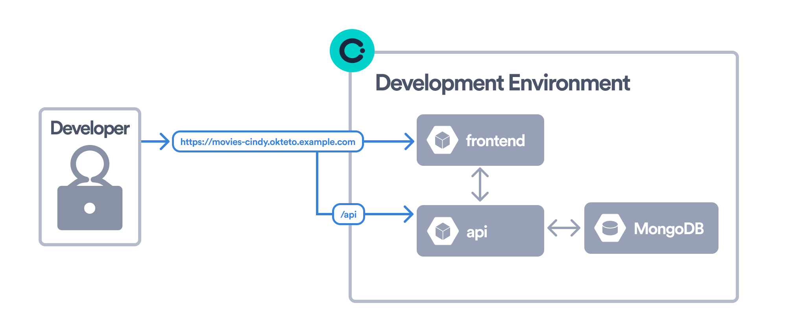

# Movies app

This example shows how to leverage [Okteto](https://www.okteto.com/) to develop a Node.js + React Sample App directly in Kubernetes. The Node + React Sample App is deployed using a Helm Chart. It creates the following components:

- A *React* based frontend, using [Webpack](https://webpack.js.org) as bundler and *hot-reload server* for development
- A very simple Node.js API using [Express](https://expressjs.com)
- A job to initialize a MongoDB database

This is a representation of the Movies app running in a Development Environment:

Follow this guide to deploy the [Movies app to Okteto](https://www.okteto.com/docs/get-started/deploy-your-app/).

